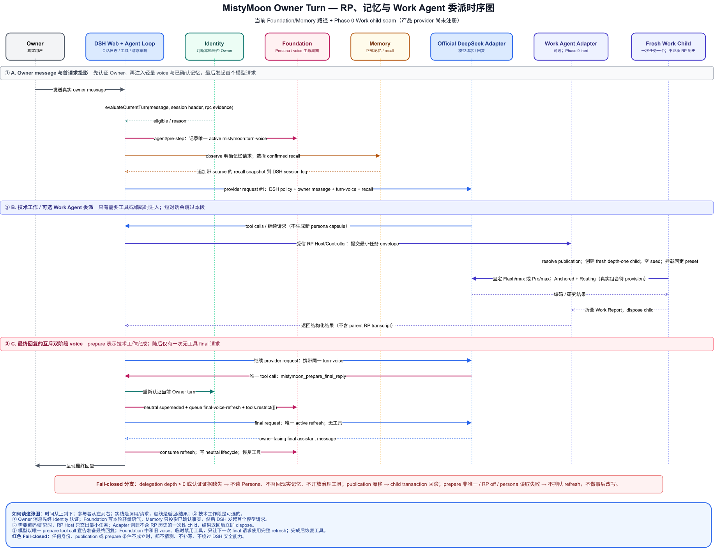

# MistyMoon 架构

MistyMoon 是 DSH 上以 RP 和长期陪伴为核心的产品层，不是第二套 Agent Runtime。它通过 DSH 插件组合注入人格、受治理记忆和本机设置能力，不修改 DSH 源码。

## 架构图

图中的实线表示当前运行依赖或调用，虚线表示规划能力或 provision 边界。静态图是 2026-08-17 的旧设计快照，其中仍保留已放弃的 Routing Suite 和 Phase 0 inert 标注；当前实现以本文和 manifest 为准：RP Host preset 与 Anchored-only product runtime 已实现并由 bundle 加载，J-Space 关闭，Routing 不再是依赖。首发只注册已完成 15/15 的 Flash/max；Pro 未注册。

### 类静态架构图

[查看 SVG](mistymoon-static-architecture.svg) · [编辑 draw.io 源文件](mistymoon-static-architecture.drawio) · [下载 PNG](mistymoon-static-architecture.png)


图中编号可按下面顺序理解：

1. **Owner / Channels**：用户从 Web 等通道发消息；消息必须先进入 DSH，不能直接读取人格或记忆。
2. **DSH Runtime**：DSH 管理 Agent、会话、工具、权限、模型与 Web Host。这一层的规则始终优先，MistyMoon 只使用公开扩展点。
3. **MistyMoon 当前插件**：Identity 只判断当前消息是否属于 Owner；Foundation 管人格和回复语气；Memory 管经审核的长期事实；Settings UI 只调用这些服务。
4. **Owner-private DSH Home**：真实人格、记忆和设置存放在 Owner 私有目录。箭头表示“由哪个模块拥有/读写”，不表示把数据上传到仓库。
5. **Work Agent**：`work-agent` 定义与 DSH 无关的共享基线、预设合同和 next-activation profile controller；`work-agent-dsh` 负责 DSH child 生命周期、已资格化 Flash provider、workspace lease、模型设置与 publication recheck。Anchored-only 资产已在 rc.7 临时 Home 完成 provision、重启发现和真实挂载验收，product runtime 由 bundle 注册。Settings UI 从 DSH live catalog 选择后续 fresh child 的 exact provider/model，只把无凭据引用写入 Owner-private `work-model.json`；默认 direct Flash，非默认 pair 为 Owner-confirmed experimental route，失败不 fallback。
6. **规划能力**：固定上游编码层已收敛为 Anchored Standard 默认 profile 与关闭的 J-Space 实验 profile；它仍是显式 provision 边界，不由套件安装自动启用。陪伴/酒馆/跑团体验仍处于规划阶段。

箭头朝向表示“调用、拥有或适配的目标”；实线是当前关系，虚线是规划关系。

### Owner Turn 运行时序图

[查看 SVG](mistymoon-runtime-sequence.svg) · [编辑 draw.io 源文件](mistymoon-runtime-sequence.drawio) · [下载 PNG](mistymoon-runtime-sequence.png)



这张图从上往下读，表示时间推进；从左往右是参与同一轮对话的组件。实线表示请求或调用，虚线表示返回结果。流程分成三段：

1. **A — Owner 消息与首请求**：Identity 先认证 Owner；Foundation 写入本轮轻量语气；Memory 只召回已确认且属于该 Owner 的事实；随后 DSH 才向模型发起首个请求。
2. **B — 可选技术工作**：只有在需要编码、研究或工具时才进入。RP 主 Agent 只交出最小任务，Adapter 创建一个不携带 RP 私密历史的一次性 child；拿到结果后立即释放。普通聊天会跳过整段。
3. **C — 最终回复**：技术工作完成后，模型只能通过唯一的 prepare tool call 请求最终回复。Foundation 将旧语气记录标为失效，并只为紧随其后的一次无工具请求提供完整人格语气；结束后恢复工具状态。

图中的红色 fail-closed 分支表示：身份、publication 或 prepare 条件不成立时，系统停止该增强流程，不猜测数据，也不绕过 DSH 的权限与安全规则。

## 运行时关系

```text
用户与各通道
      │
      ▼
DSH Agent / Session / Permission / Tools
      │
      ├─ Identity ──── Owner Eligibility ─┬─ Foundation ─ 私有人格文档与 voice gate
      │                                   │
      │                                   └─ Memory ──── 所有者治理档案与自动召回
      │                                                  │
      │                                                  └─ DSH 会话中的模型可见快照
      │
      └─ Settings UI ─ 本机回环 Host API ─ 草稿、审核与运行设置
```

DSH 会话日志保存原始交互和实际送入模型的人格、记忆投影。MistyMoon 私有目录保存跨会话的活动人格、长期事实、候选与设置。索引可以重建，来源记录和审计历史不能依赖索引反推。

`packages/work-agent` 是位于运行时插件图之外的纯合同包：只拥有不可变 Shared Baseline、固定 Work Preset/route 解析、Compatibility Gate 和版本化 `WorkReportV1`，不读取 Foundation Persona 或 Memory，不被 Settings UI 复制业务规则，也不依赖 DSH 运行时。`packages/work-agent-dsh` 是唯一接触 DSH lifecycle 的 Adapter；它通过公开的 `agents.create()`、`agentPresets.mount()` 和 child depth/options helpers 创建 fresh depth-one child，并把 baseline/manifest/route 重校验接到同步 publication commit。其 fixed-preset provider 保留 DSH descriptor、delegated policy、取消、结果折叠与 dispose 语义，但不支持 fork/continuable 或 per-request composition；产品 wrapper 在消费边界严格校验单 text-block JSON Work Report，畸形 completed 输出 fail closed，并在 completed/partial 父级结果交付前丢弃全部 reasoning blocks。标准 `parentSession` 与 one-shot descriptor 让 rc.7 原生目录可发现 child；Owner 通过 exact-address `openSubagent()` 打开 DSH 持久化的只读过程，不经过 MistyMoon 自建 transcript API。它由 bundle 加载，但不拥有 DSH 源码、Profile、provider 凭据或安装目录。

## Identity

Identity 是 Foundation 与 Memory 共同依赖的窄 Cordis 服务，不读取 Persona、记忆档案、DSH Home 或 Profile。纯 policy 同时要求 user source、canonical `delegationDepth=0` 与绑定当前 Session/message 的认证 evidence；DSH Adapter 负责从 immutable Session header 和 durable message source 构造输入。当前 loopback Web authority 使用 Host ApiProxy 持久化的非空 `rpcId`，而 depth 1 child、普通 user 标签、已结束 turn 和旧 seed evidence 都不能授权当前行为。

Foundation 只通过 `ownerMessages()` 选择可投影 Persona 的输入，并在读取 Persona 前通过 `evaluateCurrentTurn()` 授权 final prepare。Memory 用同一批次接口控制 observe/recall，并通过 DSH monotonic tool guard 保护全部七个治理工具。其他通道必须提供自己的认证 authority；缺失时安全关闭，不回退为“所有 user 都是 Owner”。

## Foundation

Foundation 管理版本化活动人格 `persona.json`、未发布的 `draft.json` 和 `versions/` 回滚历史。首次运行只从中性模板创建活动文件，升级不得覆盖用户版本。设置页保存只更新草稿；发布会先归档当前活动版本，并在草稿所基于的活动人格未被其他进程改变时原子替换活动文件。

Foundation 不为通用 preset 注册常驻人格 system section，也不在普通 assistant/tool step 重复投影 Persona。通用 preset 的 `PersonaTurnDeliveryCoordinator` 继续拥有互斥双阶段画像：每个启用 RP 的真实 owner turn 在真实 owner message 落盘后、首次 provider request 前，通过 `agent/pre-step` 决策追加一条受 `turnVoiceMaxChars` 预算约束的 `mistymoon:turn-voice` output-presentation profile；模型完成全部工作后，以唯一 tool call 调用 `mistymoon_prepare_final_reply`，再原子切换到一次无工具的 `mistymoon:final-voice-refresh`。RP Host preset 是唯一例外：preset-scoped `RP Host Composition` 把完整已发布 Persona 放入唯一 `deployment:persona`，使其成为 RP Host 的模型可见运行时身份，精确隐藏 `harness:identity` 与 final-reply 并直接结束 Owner turn；它不覆盖模型选择，会话沿用 DSH Web UI/Agent 当前选定的 provider/model 路由，也不生成 turn-voice/final-voice-refresh。两条路径都由 DSH request/header 记录模型实际所见文本。

RP Host Composition 只通过 DSH 公开的 scoped tool restriction 和 preset composition seam 生效；识别失败即拒绝加载，不扫描 Cordis Context 的 Symbol 或宿主私有 shape。其 model-facing catalog 与 monotonic execution guard 每次组装都收敛到封闭能力面，本地 `read` / `grep` / `glob` 还要通过真实路径工作区边界。prompt policy 与 capability 分离：安全、权限、审批、协作模式、外部副作用及未知 section 全部保留；rc.7 尚无“可过滤工具帮助”标记，所以当前不按 `tool:*` / `tools:*` 名称删除任何工具说明。

模型跳过 prepare、prepare 与其他工具并列、`off`、persona 读取失败、Code Mode/嵌套调用或无法证明下一请求工具为空时，Coordinator fail closed：不排队 refresh、不安装 gate、不事后改写，短对话由初始 profile best-effort 完成。限制与 voice 都从 durable tool/result meta、`user/message`、assistant、surface replacement 和 inbox splice 重建；prepare 已记录且 initial 已 neutralized 而 final 未完成的进程重启会恢复空工具 gate，歧义时 fail closed 保留 DSH 普通工具能力，不用 step/token/自然语言猜测 finality。

```text
DSH 系统提示词（minimal / standard / 其他预设，保持不变）
  → 真实 owner message
  → 同 turn 唯一 active mistymoon:turn-voice（短对话兜底，轻量）
  → 中间请求：业务 tools 与任务，复用同一条 profile，无新投影
  → mistymoon_prepare_final_reply（唯一 tool call）
  → turn-voice 替换为 neutral superseded record
  → 单次无工具 final 请求：唯一 active mistymoon:final-voice-refresh
  → final assistant 完成后 refresh 替换为 neutral consumed record，工具恢复
```

RP 展示等级与 DSH 能力模式正交：`off` 两条路径都不注入，`companion` 提供简洁身份、关系和自然语言语气，`immersive` 的完整 persona/reference dialog 只允许出现在合法 final refresh。三种等级都不改变 Agent 预设、协作模式、Plan、工具、权限、模型路由或安全规则。voice 文本明确规定 Coding、调试、研究和工具调用保持 DSH 行为与技术准确性，不角色化代码、命令、计划、诊断和技术决策。等级选择写入当前 DSH 会话日志，可用 `/rp` 命令查看和切换。

角色卡导入也归 Foundation 管理；任何导入结果先成为私有草稿，不能自动发布。设置页只提交生命周期操作，不自行拼接提示词。

Character Card 导入由 Host 解析 V1/V2/V3 JSON、PNG/APNG `tEXt` 块和 CHARX 根 `card.json`。容器解析限制总大小、JSON 大小、PNG CRC、ZIP 条目数、路径、展开总量和压缩比；CHARX 资产不解压、不执行、不自动联网。字段映射默认排除 `system_prompt` 和 `scenario`，Creator Notes、问候、世界书、扩展与未知字段永不自动进入人格。用户保存映射后得到普通未发布人格草稿，仍须通过同一发布流程才会进入后续 RP 快照。

## Memory

Memory 使用 v2 事务式 JSONL 档案：每个新 candidate/record 都属于明确 Owner 和严格 `MemoryScopeV1`，引用同一逻辑事务中的不可变 Observation，并携带 memory kind、recordedAt 与可选有效区间。来源幂等键由 Owner、authority、exact scope、source kind 和 source id 共同组成；Companion Reality、Character Scene 与 Campaign Branch 不自动复制或混召回。新事实、纠正、遗忘和审核决定都是不可变 domain events，一个逻辑 mutation 只占一条 hash-linked transaction。活动视图由完整事务重放得到；纠正不改写旧值，遗忘记录保留审计但不再召回。生产 writer 通过跨进程 lease 在写前重读，文件 append 与 fsync 成功后更新相邻 durability checkpoint，最后才发布进程内 snapshot。

旧 domain schema v1（无论是原始 storage v1 还是已包进 storage v2）以 `scope-migration-required` fail closed。Maintenance plan 必须显式绑定 Owner、authority、目标 scope、默认 kind、`legacy-created-at` 策略、exact digest、过期 token 和 exact backup，apply 才会一次性生成 Observation 与 scoped domain v2；正文不参与字段推断。非法 JSON、摘要链、领域状态或 checkpoint 进入 `quarantined`。尾部恢复仍只允许裁剪最后完整事务之后的 partial tail，内部损坏只生成 `restore-required`，并提供只读 rollback rehearsal。自动命名 backup 达到保留上限时拒绝继续创建，不自动删除。Windows 采用 Owner 已接受的文件 fsync + atomic rename + reopen 契约；Node 不支持目录 fsync，因此报告相应的断电窗口而不虚构更强 durability。

自动召回挂在 `agent/pre-step`，由 MistyMoon 从 Owner Eligibility 构造可信 access context，先按 confirmed、Owner、authority、exact scope、有效时间与 confidential 双门做硬过滤，再排序并把结果作为带来源的 DSH 消息写入会话。工具参数不包含 Owner、scope 或 disclosure override；Settings UI 只消费 Memory 提供的 loopback governance service，不读取档案或复制过滤规则。

长期方向是定义稳定的 `MemoryProvider` 接口：

```text
MistyMoon 治理层
├─ 身份、可见性、候选审核、来源消息 ID、替代关系
├─ 自动召回与 DSH 会话投影
└─ Provider
   ├─ 内置 JSONL / 可重建索引
   ├─ Noema（候选，先 shadow mode）
   ├─ Mnemon（候选）
   └─ Mem0（候选，独立服务）
```

Provider 可以负责持久化、全文检索、图检索和排序，但不能拥有产品级身份或审核策略。切换 Provider 必须保持相同的规范化事实、来源、可见性和修订语义。

## Noema 决策

截至固定提交 `ZSeven-W/dsh-noema@acfb4cd58c9486412fb3bfc9e978eae66e04e5a7`，不直接替换 MistyMoon Memory。Noema 的 BM25、PageIndex、图关系、多路融合、可解释召回、冲突候选、替代墓碑和文件原子写入值得采用；但当前 DSH 适配器主要通过系统提示词让模型自行调用 `noema_recall`，默认自动接受新记忆，且导入身份、可见性和来源消息 ID 不能保真映射 MistyMoon 的 RP 治理。

采用路径分三步：

1. 先在内置档案吸收替代链、冲突审核、文件锁、原子写和无敏感载荷审计。
2. 定义 Provider 一致性测试，让相同输入得到相同所有者范围和生命周期结果。
3. 以只读 shadow mode 接入 Noema，对比召回质量、延迟和故障恢复；通过门槛后才允许用户选择它作为索引/检索后端。

Noema 内核仓库在审计固定点缺少独立许可证文件，尽管其 Cargo 元数据声明 MIT。澄清前不把其二进制随 MistyMoon 包再分发。

## RP Agent 与规划中的体验模式

当前套件已携带 `mistymoon-rp-host-v2` 与 Flash-only Work provider。项目不再通过 npm registry 向最终用户分发；完成 P0 和 P1（桌面跑团模式除外）后，目标发行物是预装套件的 DSH Desktop。installer 仍把 DSH Profile add、RP Host preset 与 Anchored Work preset 的 provision 合成一次可预览/确认的补偿事务，但只作为 Desktop 构建、开发预览和内部更新/回滚 seam：前者仍由 DSH Profile manager 拥有，后者仍只向独立 DSH Home 的 `.agent-presets/<versioned-id>` 原子发布，运行期插件不会自修改安装目录。版本化 bundle 缓存、两个 preset ID/指纹和单代 previous 指针记录在 installer-owned `mistymoon/install-state.json`；私有 Persona、Memory、凭据、会话和日志不进入应用包。拓扑使用一个 Owner-facing `RP Host Agent` 和 fresh one-shot `Work Agent`：前者负责 RP、澄清、确认、只读 Web/工作区文件检查、委派与最终交付，后者执行编码、研究、审查或规则分析。RP Host 的组装提示词以 Persona 为身份并隐藏 harness identity，同时保留安全、权限、沙箱、审批、协作模式和未知工具治理 section；真实工具面由封闭 catalog 与执行 guard 强制。第一版禁止 fork，不复制父会话中的人格、关系记忆和 RP 历史。Owner 可在设置页从 DSH live catalog 选择后续 Work child 模型；OpenCode Go 只是一个尚未独立资格化的 experimental exact pair，默认仍是已资格化 direct Flash。分发边界见 `docs/adr/0002-desktop-bundled-distribution.md`。

委派边界由一个代码级 deep module 强制，而不是 prompt 自律：preset/depth Role Gate 强制星型拓扑；child 工具白名单排除 subagent control、Memory 和 final-reply；共享 workspace lease 跨 RP Host Session 串行并保持到 `dispose()`；fresh Session 与 `inheritsParentContext=false` 隔离父 transcript；child 不含 send/list/read-other-output 通道。MistyMoon v1 不引入通用角色池或多层调度器，仅保留这些可验证约束。

Work Agent 默认使用固定 Anchored Standard 上游及其 durable tool phase/promotion；Routing Suite 不是产品组成。Switchable Work Agent 在每次 fresh child creation transaction 内挂载一个完整、版本化的 Work Preset；profile commit 只影响下一次 one-shot activation，不热重绑已有 Session。Flash/max 与 Pro/max route、共享基线、模型可见 activation revision 和 publication commit 重校验都已实现。J-Space 因上游 controller 默认写工作区 `.jspace/`，在完成 Owner-private ledger 重定向与质量验证前保持 not-ready。[可切换 Work Agent 架构](../specs/014-switchable-work-agent/SPEC.md)定义该边界。

由于 rc.7 delegation prompt 仍标记为普通 user source，已实现的统一 Owner Eligibility 只允许经过认证、位于 delegation depth 0 的真实 Owner message 触发 Foundation voice、Memory observation/recall 或治理工具；真实 Work child 的这一 P0 前置门已经解除。详细路由、DeepSeek V4 thinking、preset provision 与验收见 [RP Agent 委派设计](../specs/011-rp-agent-delegation/SPEC.md)。

RP 展示等级、体验模式和 DSH 协作模式保持三条正交轴。体验模式计划包含 `companion-chat`、`character-scene` 和 `tabletop-campaign`。Character Scene 的 Scene Role 不覆盖长期陪伴 Persona；Campaign 的角色表、资源和世界当前状态属于 Canon State，不依赖概率记忆召回。Work Agent 只能提出规则/状态建议，RP Host Agent 才能面向玩家叙述并提交正史。详细循环与范围见 [体验模式设计](../specs/013-roleplay-experience-modes/SPEC.md)。

长期记忆目标架构保留 MistyMoon 追加档案作为唯一事实源，把全文、向量、图、重排和摘要放在可重建 Provider seam 后；Companion Reality、Character Scene fiction 和 Campaign Branch 禁止混召回。详见 [RP Memory 目标架构](../specs/012-rp-memory-architecture/SPEC.md)。

## 通道和桌面端

QQ/NapCat、Web、手机 SSH 入口和未来桌面形象都是 Adapter。它们先把外部账号映射为 MistyMoon 主人、熟人或陌生人身份，再进入同一 Agent 与治理层。未经映射的外部身份不能自动继承本机主人的私密记忆。

Windows 发行计划采用单个签名安装程序和安装后的目录化 Runtime。NapCat 由启动器显式拉起、健康检查和受控停止；启动器只管理自己创建的进程。Live2D 只消费 Presence/表现意图，不读取原始私密记忆。

## 自动部署

自我修改必须发生在隔离工作区，经过构建、测试、发布审计和风险分类。只有可回滚、无权限扩张、不改人格与记忆语义的低风险插件变更可以自动部署。人格发布、永久删除、凭据、网络暴露、权限和公开 Git 操作始终需要人工确认。
